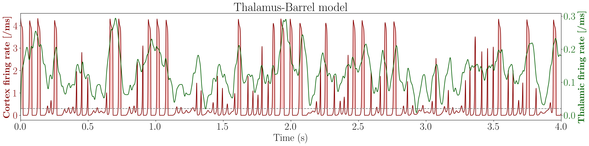

Code to reproduce the results of **"Whisker stimulation reinforces a resting-state network in the
barrel cortex: nested oscillations and avalanches"** by Mariani et al, to be published in Plos Comp Bio 2026.
## Main Dependencies

The project requires the following Python packages:

```bash
Packages used and their versions:
numpy==1.21.6
scipy==1.10.0
matplotlib==3.7.2
statsmodels==0.14.0
powerlaw==1.5
emd-signal==0.5.5
pandas==2.0.3
```

